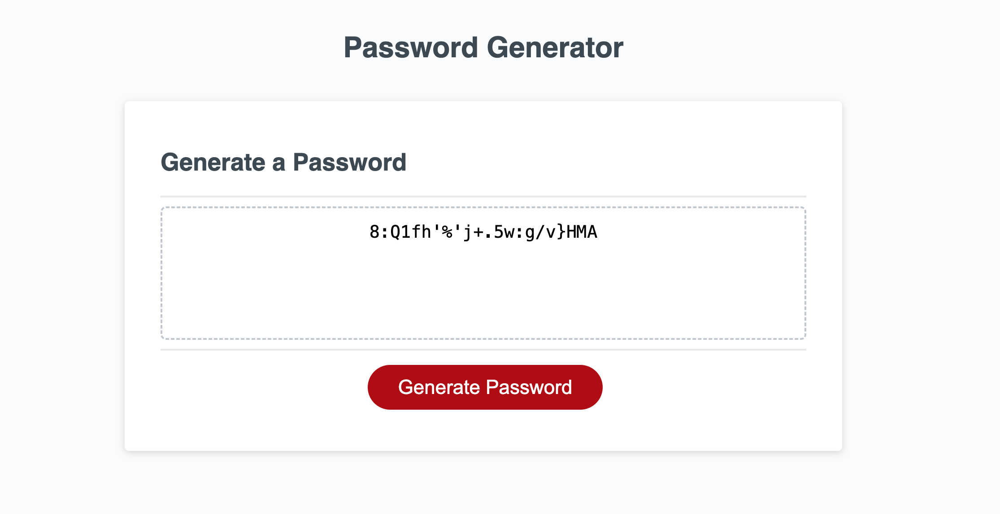

# password-generator-ahmed 

The purpose of the password generator was to allow the user to create their own randomly generated password that fulfills all the requirements. The options can be modified based on desire or neccessity.

I used the format that was given to us to create three different functions. the first function was to generate all the password options and put them into a new large array. The second function was the for loop that iterates over the new large array the number of times inputed by the user. The last function generates the password. 

https://github.com/ahmed-ibrahim20560/password-generator-ahmed

https://ahmed-ibrahim20560.github.io/password-generator-ahmed/